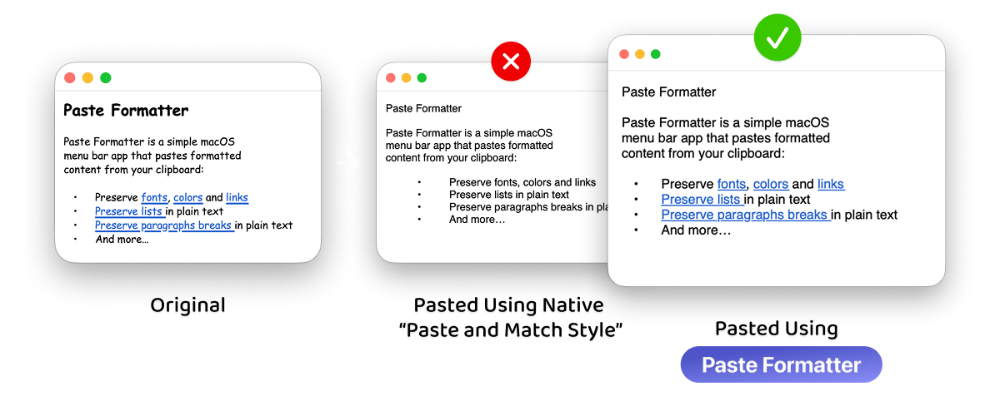

# Paste Formatter

Paste Formatter is a lightweight macOS menu bar app for pasting formatted clipboard content with the styling you actually want.

Use it when “Paste and Match Style” removes too much, or when normal Paste carries over fonts, colors, and spacing you do not want. Paste Formatter lets you choose what to preserve before pasting into the active app.



## Features

- Paste from the menu bar or with a configurable global keyboard shortcut
- Preserve or remove fonts
- Preserve or remove text colors
- Preserve or remove links
- Preserve list markers and indentation in plain-text fields
- Preserve paragraph breaks in plain-text fields
- Launch automatically at login

To paste directly into the active app, Paste Formatter uses macOS Accessibility permission.

## Download

[Get Paste Formatter](https://paste-formatter.app) from the Mac App Store.

## Build

To build your own copy, check out this repository, ensure you have [Xcode](https://developer.apple.com/xcode/) and its [command-line tools](https://developer.apple.com/documentation/xcode/installing-the-command-line-tools/) installed, and run:

```bash
./scripts/build-app.sh --bundle-identifier <BUNDLE_IDENTIFIER>
```

This creates `dist/Paste Formatter.app`.

To sign the app bundle as well, pass the name of a code signing identity available in your local keychain:

```bash
./scripts/build-app.sh \
  --bundle-identifier <BUNDLE_IDENTIFIER> \
  --signing-identity "<SIGNING_IDENTITY>"
```

To create a zipped notarized release build, use:

```bash
./scripts/build-app.sh \
  --bundle-identifier <BUNDLE_IDENTIFIER> \
  --signing-identity "<SIGNING_IDENTITY>" \
  --notarize \
  --release-zip
```

To create a signed Mac App Store installer package, use:

```bash
./scripts/build-app.sh \
  --bundle-identifier <BUNDLE_IDENTIFIER> \
  --signing-identity "3rd Party Mac Developer Application: <NAME> (<TEAMID>)" \
  --installer-signing-identity "3rd Party Mac Developer Installer: <NAME> (<TEAMID>)" \
  --provisioning-profile "<PROFILE.provisionprofile>" \
  --app-store-package
```

## FAQ & Support

First, check the [FAQ on Paste Formatter's website](https://paste-formatter.app/help). If your question or issue is not listed, or you have a suggestion, open an [issue](https://github.com/nielsmouthaan/paste-formatter/issues).

## Contribution

Contributions are welcome. Feel free to fork the repository and submit a pull request.

## License

Paste Formatter is available under the MIT license. See [LICENSE](LICENSE) for more info.
